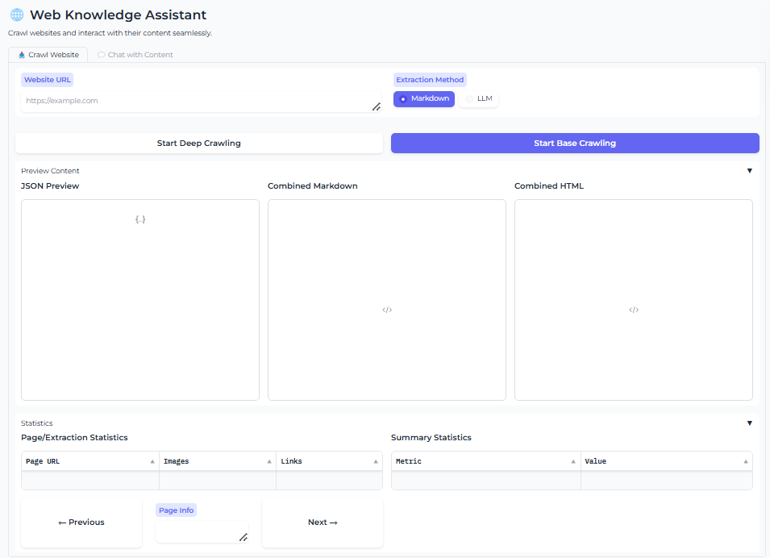
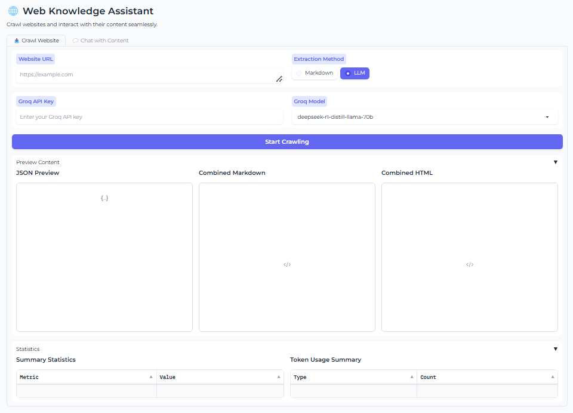
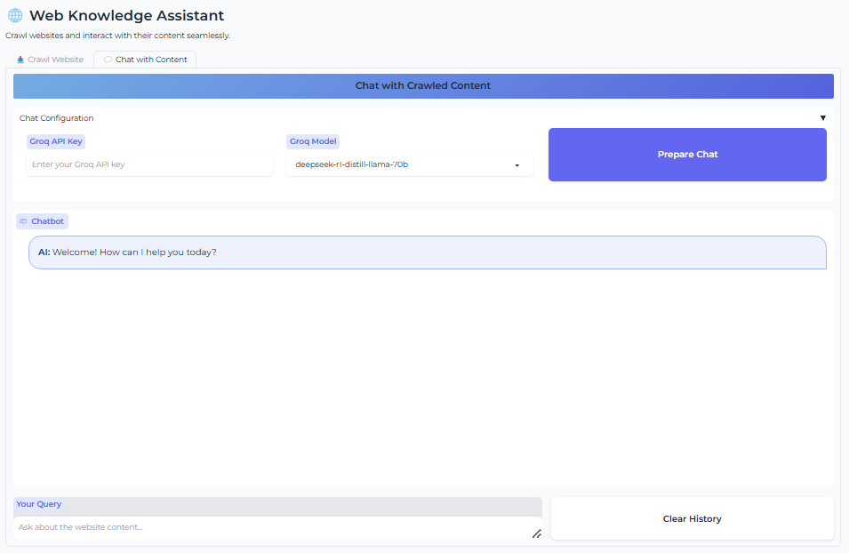
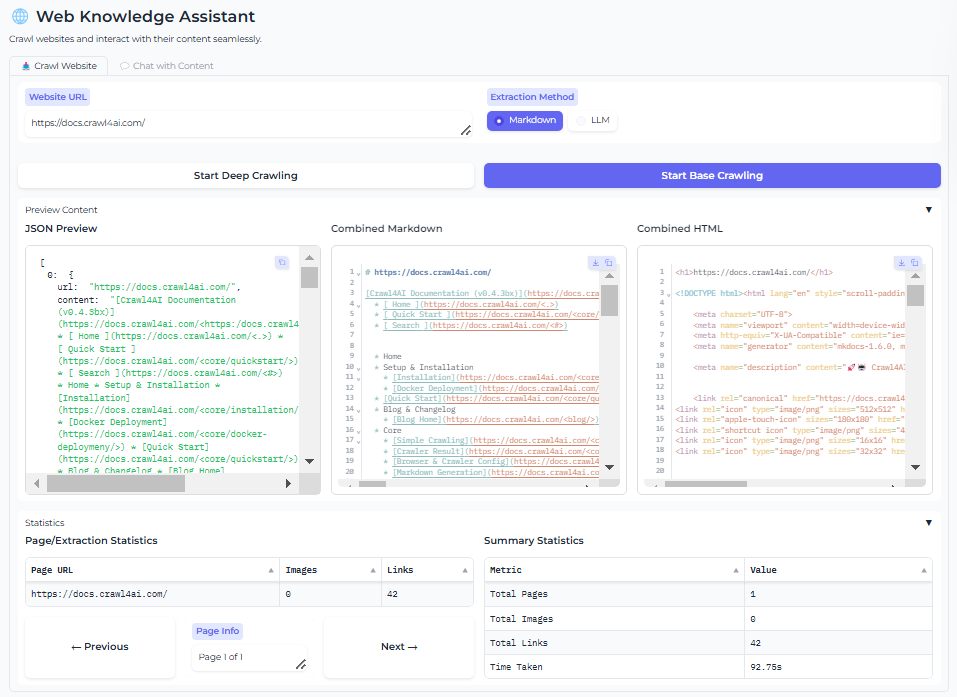
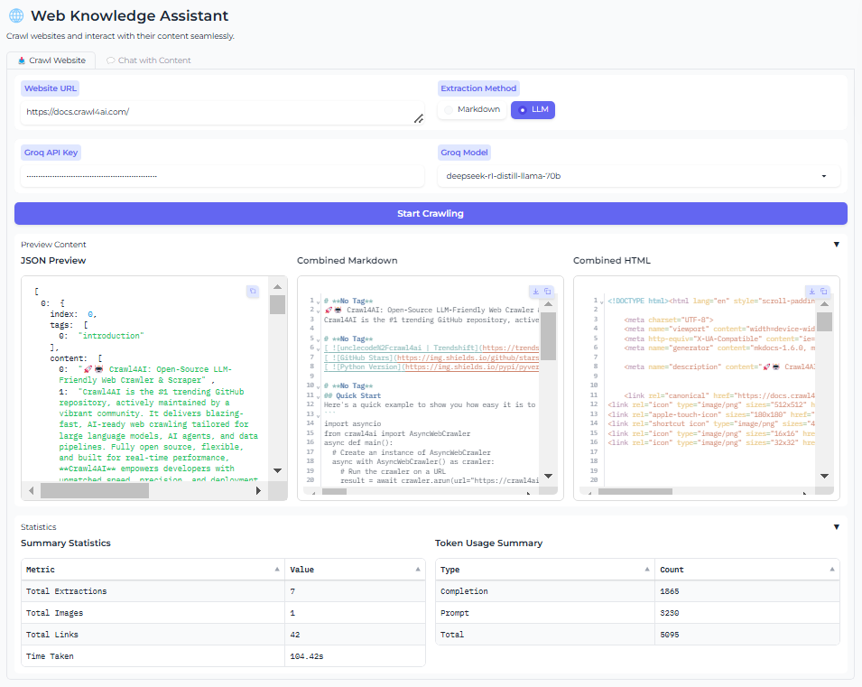
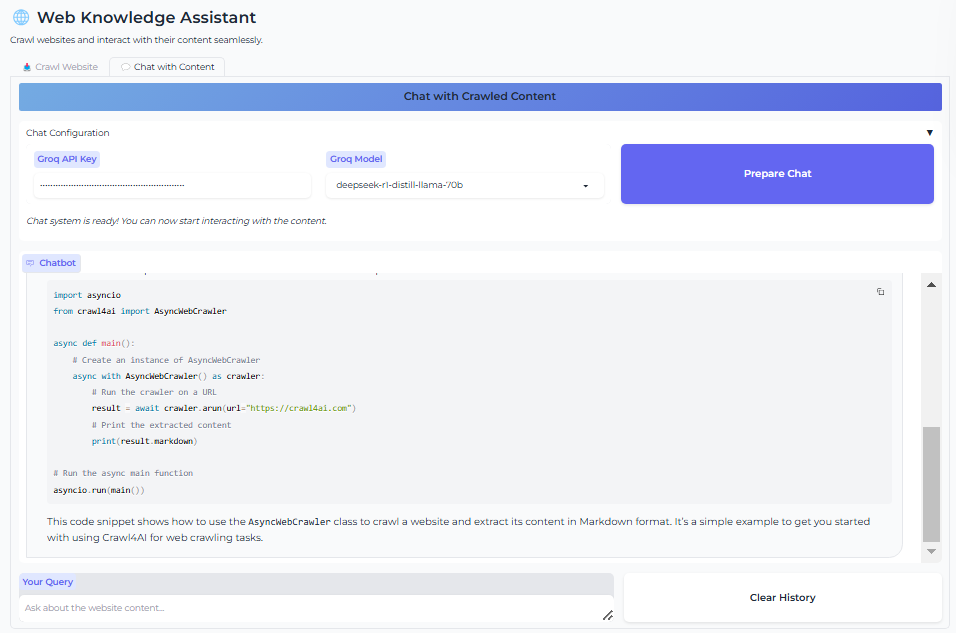

# Web Knowledge Assistant

Welcome to the **Web Knowledge Assistant** project! This tool empowers you to crawl websites and interact with their content in a seamless, intuitive way. Whether you’re using a traditional Markdown extractor or leveraging an LLM (via Groq) for content extraction, this application has got you covered.

---

## Table of Contents

- [Features](#features)
- [Screenshots](#screenshots)
- [Installation & Setup](#installation--setup)
- [Project Architecture](#project-architecture)
- [Getting a Groq API Key](#getting-a-groq-api-key)
- [Usage](#usage)
- [Notes & Tips](#notes--tips)
- [Contributing](#contributing)
- [License](#license)

---

## Features

- **Dual Extraction Methods:**
  - **Markdown Extractor:**  
    Choose between **Base Crawl** (quick single-page scrape) or **Deep Crawl** (comprehensive crawling using sitemaps and internal links).  
    *Note:* Deep Crawls may take longer depending on the website's structure.
  - **LLM Extractor:**  
    Uses a single-page crawl, powered by Groq’s DeepSeek-R1-Distill-LLama-70B model and more.
- **Interactive Gradio Interface:**  
  Provides real-time previews of JSON, Markdown, and HTML content, along with detailed statistics on pages, images, and links.
- **Chat-Enabled Exploration:**  
  Engage directly with the crawled content through an interactive chat powered by a custom RAG (Retrieval-Augmented Generation) system.

---

## Screenshots

Here are some visuals to showcase the before and after states of crawling:

### Before Crawling
- 
- 
- 

### After Crawling
- 
- 
- 

---

## Installation & Setup

### Prerequisites

- **Python 3.12+**
- **pip** (Python package installer)

### Clone the Repository

```bash
git clone https://github.com/sami-rajichi/Web-Knowledge-Assistant.git
cd web-knowledge-assistant
```

### Install Dependencies

All dependencies are listed in the `requirements.txt` file. To install them, simply run:

```bash
pip install -r requirements.txt
```

*Note:* Due to version conflicts between Gradio and Crawl4AI (specifically regarding the latest `aiofiles` package), we've pinned specific versions in the requirements file. While a newer Gradio version offers enhanced async performance, using an older version was necessary for compatibility with Crawl4AI.

### Setting Up Crawl4AI

This project uses [Crawl4AI](https://github.com/crawl4ai/crawl4ai) for web crawling. Ensure it's installed via the requirements file above. For advanced configurations or troubleshooting, please refer to the official Crawl4AI documentation.

---

## Project Architecture

Below is an overview of the project structure and workflow:

```
Web-Knowledge-Assistant/
│
├── app.py                  # Main Gradio interface and application logic.
├── crawler.py              # Handles web crawling using Crawl4AI (sitemap parsing, deep crawl, LLM extraction).
├── rag_handler.py          # Implements the RAG system using LangChain and FAISS for content retrieval.
├── requirements.txt        # Lists all required dependencies.
├── images/                 # Contains screenshot images (before and after crawling).
│     ├── BEFORE_Crawling_With_Markdown.png
│     ├── BEFORE_Crawling_With_LLM.png
│     ├── BEFORE_Chatting.png
│     ├── AFTER_Crawling_With_Markdown.png
│     ├── AFTER_Crawling_With_LLM.png
│     └── AFTER_Chatting.png
└── README.md               # Project documentation.
```

### Workflow Diagram

```
                +-----------------+
                |   User Input    |
                |  (Website URL,  |
                | Extraction Type,|
                |   API Key, etc.)|
                +--------+--------+
                         |
                         v
                +-----------------+
                |   app.py        |
                |  (Gradio UI)    |
                +--------+--------+
                         |
          +--------------+--------------+
          |                             |
          v                             v
+----------------+             +--------------------+
|  crawler.py    |             |   rag_handler.py   |
| (Web Crawling) |             | (RAG & Chat System)|
+-------+--------+             +----------+---------+
        |                                 |
        v                                 v
+---------------+               +---------------------+
| Crawl4AI Core |               |    LangChain, FAISS |
|   Functions   |               |   ChatGroq Model    |
+---------------+               +---------------------+
```

The crawler fetches and processes website content (using either deep or base crawling) and then passes the data to the RAG system, which indexes the content and powers the chat interface.

---

## Getting a Groq API Key

To use the LLM extraction features, you'll need a Groq API key. Follow these steps:

1. Visit [Groq's website](https://groq.com).
2. Sign up for an account if you haven’t already.
3. Once logged in, navigate to your dashboard.
4. Locate the API key section and generate a new key.
5. Copy the API key and use it in the application when prompted (both in the crawling and chat configuration tabs).

---

## Usage

Run the application by executing:

```bash
python app.py
```

The Gradio interface will open in your browser. From there:

1. **Enter the Website URL:**  
   Provide the URL of the website you want to crawl.
2. **Choose the Extraction Method:**  
   - For **Markdown extraction**, select between:
     - **Base Crawl:** Crawls only the main page.
     - **Deep Crawl:** Recursively scrapes the website (can take longer on larger sites).
   - For **LLM extraction**, note that only Base Crawling (single-page) is supported.
3. **Enter the Groq API Key** (if required).
4. **Start Crawling:**  
   View the previews and statistics once the crawl completes.
5. **Chat with the Content:**  
   Use the interactive chat to ask questions based on the crawled data.

---

## Notes & Tips

- **Crawling Options:**  
  - **Deep Crawl:**  
    Attempts to use sitemaps and link discovery for comprehensive data extraction. This is ideal for in-depth analysis but may take longer on complex sites.
  - **Base Crawl:**  
    Focuses on a single page, providing quicker results. LLM extraction supports only this mode.
  
- **Gradio Version Caveat:**  
  The latest Gradio offers enhanced asynchronous functionality. However, due to a dependency conflict with the latest `aiofiles` package (used by Crawl4AI), we’re using an older version which might affect performance, especially with queuing.

---

## Contributing

We welcome contributions! If you have ideas for new features, improvements, or bug fixes, please fork the repository and submit a pull request. Your feedback and contributions are highly appreciated.

---

## License

This project is licensed under the [MIT License](LICENSE).

---

Happy crawling and chatting! If you encounter any issues or have suggestions, please open an issue on GitHub or reach out.